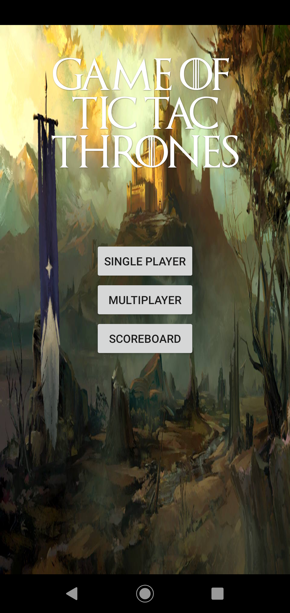
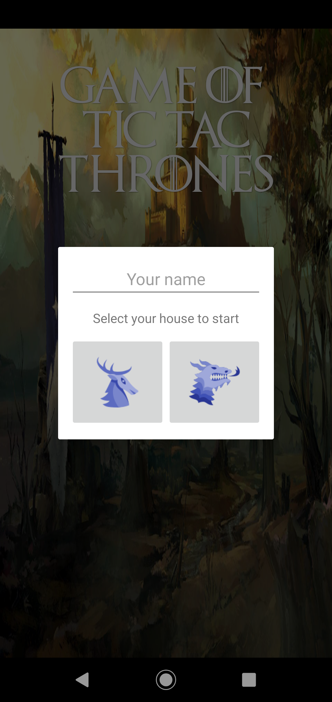
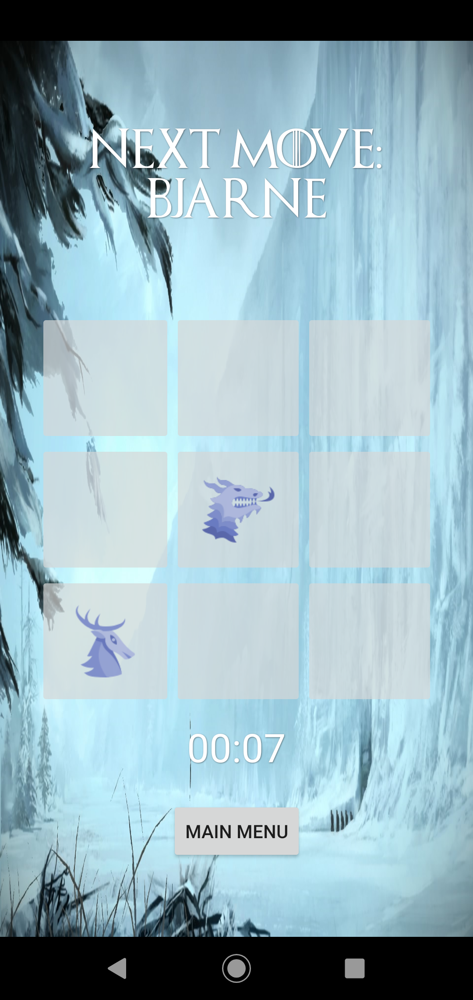
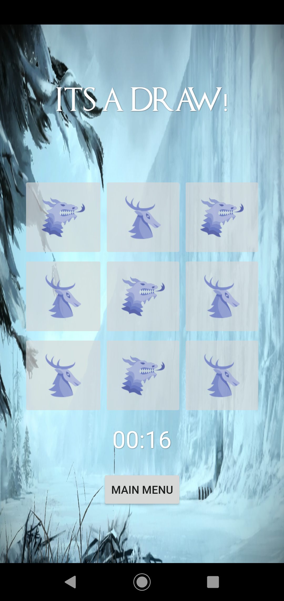
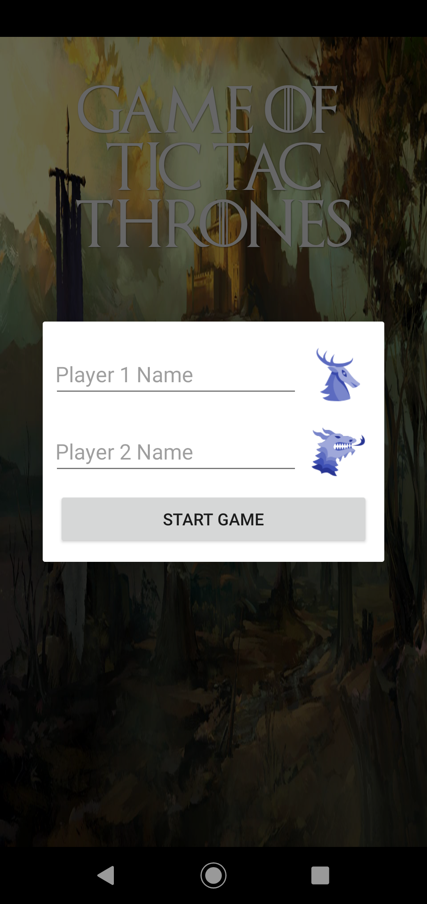
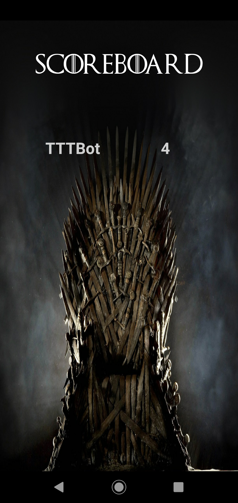

# Game of tic tac thrones
Exam assignment course PGR202 Android Programming (1/2)

This is one of two apps made for the course PGR202 Android Programming at Kristiania University College.

## Assignment
Create your own version of the game Tic Tac Toe.

### Requirements and/or goals
- Application has Fragment architecture
- Application uses local storage
- Application has logic to play single player against a computer
- Application should follow Android's design principles, architecture and coding standards
- Application should be described in a separate text report, where strengths and weaknesses are explained as well as explanations of the included code files and your own reasoning behind choices made
- Application's architecture and flow should be modelled
- Screenshot of all screens in the applications needs to be included in the report

Extra credit
- Significantly emphasized aesthetics and design of the application
- Implement the computer AI so that the teacher can't beat it within 10 games

### Results
This was my first ever Android app and also my first time programming in Kotlin. 

The assignment was handed out very early in the semester, and I think it shows in the final result that the application was the first most of us ever made while progressing through the course. I decided to make the app into a "game of thrones" theme, where the player can pick which House (family) to fight for instead of crosses and circles. It uses SQLite/Room for local storage, and I implemented the computer player with a minimax-algorithm to make it unbeatable for the extra credit. 

All fonts, graphics, etc. are found randomly online for the purpose of this school assignemtn and I do not intend any copyright infringement what so ever with any usage in this application.

### Screenshots
   

   
